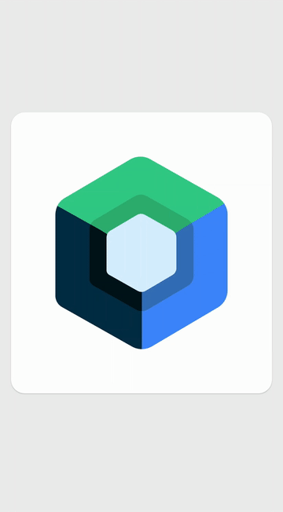

<a id="readme-top"></a>
# Kotlin Compose

[![Contributors][contributors-shield]][contributors-url]
[![Forks][forks-shield]][forks-url]
[![Stargazers][stars-shield]][stars-url]
[![MIT License][license-shield-v1]][license-url]

<!-- PROJECT LOGO -->
<br />
<div align="center">
  <a href="https://github.com/ORT-Argentina/kotlin-compose">
    
  </a>

  <h3 align="center">Kotlin Compose</h3>

  <p align="center">
    Repositorio de la materia <strong>Taller de Programación 3</strong> (ORT Argentina): proyectos Android en Kotlin y Jetpack Compose, organizados por tema a medida que se avanza en la cursada.
    <br />
    <a href="https://github.com/ORT-Argentina/kotlin-compose"><strong>Ver los ejemplos »</strong></a>
    <br />
    <br />
    <a href="https://github.com/ORT-Argentina/kotlin-compose">Ver ejemplos</a>
    ·
    <a href="https://github.com/ORT-Argentina/kotlin-compose/issues/new?labels=bug&template=bug-report---.md">Reportar un Bug</a>
    ·
    <a href="https://github.com/ORT-Argentina/kotlin-compose/issues/new?labels=enhancement&template=feature-request---.md">Solicitar un nuevo proyecto</a>
  </p>
</div>

## Índice

- [Cómo clonar este repositorio](#cómo-clonar-este-repositorio)
- [Temas y proyectos](#temas-y-proyectos)
  - [Fundamentos de Compose](#fundamentos-de-compose)
  - [Vistas tradicionales (XML)](#vistas-tradicionales-xml)
  - [Listas y estado](#listas-y-estado)
  - [Consumo de APIs REST](#consumo-de-apis-rest)
  - [Persistencia local (Room)](#persistencia-local-room)
  - [Arquitectura (MVVM, DI, Clean Architecture)](#arquitectura-mvvm-di-clean-architecture)
  - [Firebase](#firebase)
  - [Kotlin Multiplatform](#kotlin-multiplatform)
  - [Challenges y simulacros](#challenges-y-simulacros)
- [Proyectos de referencia (submódulos)](#proyectos-de-referencia-submódulos)
  - [Colaboradores de cada submódulo](#colaboradores-de-cada-submódulo)
- [Tecnologías](#tecnologías)
- [Cursos](#cursos)

<p align="right">(<a href="#readme-top">volver arriba</a>)</p>

## Cómo clonar este repositorio

Este repo usa **submódulos de git** para los proyectos de referencia externos (samples oficiales de Android, Firebase, etc.), así que hay que clonarlo trayéndolos también:

```bash
git clone --recurse-submodules git@github.com:ORT-Argentina/kotlin-compose.git
```

Si ya lo clonaste sin ese flag:

```bash
git submodule update --init --recursive
```

<p align="right">(<a href="#readme-top">volver arriba</a>)</p>

## Temas y proyectos

### Fundamentos de Compose

Primeros pasos con Composables, estado y Material3.

| Proyecto | Descripción |
|---|---|
| [`HolaMundoPersona`](HolaMundoPersona) | Ejercicio introductorio "Hola Mundo" en Compose, con un modelo simple (`Persona`) y un composable raíz básico. |
| [`LoginRegisterCompose`](LoginRegisterCompose) | Variante del ejercicio anterior, con pantallas de Welcome/Login/Register armadas con componentes propios. |
| [`Challenges/HolaMundo`](Challenges/HolaMundo) | Ejercicio de práctica con pantallas Welcome/Login/Register, Navigation Compose y Material3. |

### Vistas tradicionales (XML)

| Proyecto | Descripción |
|---|---|
| [`AppXML`](AppXML) | Proyecto con Views/XML clásicas (`AppCompatActivity`, Fragments, layouts XML) y RecyclerView, sobre el template "List/Detail" de Android Studio. |

### Listas y estado

Manejo de listas dinámicas y estado de UI, tanto con `LazyColumn` como emulando patrones de RecyclerView.

| Proyecto | Descripción |
|---|---|
| [`FirstAndroidProject`](FirstAndroidProject) | Primer proyecto con una lista (`LazyColumn`) de mensajes/imágenes; incluye Firebase Auth como dependencia. |
| [`ZenListChecklist`](ZenListChecklist) | App de checklist/lista de tareas ("ZenList") con pantalla Home en `LazyColumn` sobre un modelo `ChecklistGroup`. |
| [`RecyclerViewJCYTT`](RecyclerViewJCYTT) | A pesar del nombre, está implementado 100% en Compose: usa `LazyColumn` para simular una lista tipo RecyclerView con ítems expandibles/animados (`animateDpAsState`). |

### Consumo de APIs REST

Networking con Retrofit, serialización y carga de imágenes.

| Proyecto | Descripción |
|---|---|
| [`MarsPhotos`](MarsPhotos) | Codelab oficial de Google: consume una REST API de fotos de Marte con Retrofit + kotlinx.serialization, con arquitectura Repository + ViewModel y carga de imágenes con Coil. |
| [`RickAndMorty2`](RickAndMorty2) | Cliente de la API pública de Rick and Morty con arquitectura por capas (use case / repository / presentation), paginación, Retrofit + Gson y Coil. |

### Persistencia local (Room)

| Proyecto | Descripción |
|---|---|
| [`Mytask`](Mytask) | App de notas/tareas con Room (DAO, Database Provider) y pantallas de lista/alta en Compose vía ViewModel. |
| [`ChatHiltRoom`](ChatHiltRoom) | App de login/registro y chat con MVVM + Hilt, Room para persistencia y Navigation Compose. |
| [`AuthCameraRoom`](AuthCameraRoom) | Flujo de autenticación con captura de imágenes: Room, Retrofit, CameraX y Material3 Adaptive. |

### Arquitectura (MVVM, DI, Clean Architecture)

| Proyecto | Descripción |
|---|---|
| [`Quote`](Quote) | App de frases con arquitectura por capas (auth, data, di, network), Hilt para inyección de dependencias, Retrofit + Gson, Room para favoritos y Firebase Auth con Google Sign-In. |
| [`BootShop`](BootShop) | App de e-commerce (tienda de zapatillas) con MVVM, navegación por Drawer/BottomBar, DataStore para preferencias y Coil. |

*(`ChatHiltRoom` y `RickAndMorty2` también aplican estos patrones — ver secciones de Persistencia y Networking.)*

### Firebase

| Proyecto | Descripción |
|---|---|
| [`Firebase`](Firebase) | Demo integral de Firebase en Compose: Firestore, Realtime Database (notas y chat), Authentication (incluye login por teléfono) y Remote Config. |
| [`MyTodoListORT`](MyTodoListORT) | A pesar del nombre, es una demo de IA generativa (sample "Baking" de Gemini) que usa Firebase AI para generar texto/recetas a partir de imágenes, con patrón `UiState` sellado. |

### Kotlin Multiplatform

| Proyecto | Descripción |
|---|---|
| [`KotlinMultiplatform`](KotlinMultiplatform) | Plantilla oficial de Kotlin Multiplatform / Compose Multiplatform (Android + iOS), con módulos `composeApp`, `shared` e `iosApp`. |
| [`MyApplicationMultiplaform`](MyApplicationMultiplaform) | Plantilla clásica de Kotlin Multiplatform Mobile (KMM) con módulos `shared`, `androidApp`, `iosApp` y un `Greeting`/`Platform` de ejemplo (`expect`/`actual`). |

### Challenges y simulacros

| Proyecto | Descripción |
|---|---|
| [`Challenge1`](Challenge1) | Challenge de login/registro (Welcome/Login/Register) con Navigation Compose y componentes reutilizables. |
| [`Challenges/First`](Challenges/First) | Segundo ejercicio de práctica, mismo formato que `Challenges/HolaMundo`. |
| [`simulacro-2025`](simulacro-2025) | Simulacro de examen: app de pedidos de café con pantallas Welcome/Home y un modelo `Coffee`. |

<p align="right">(<a href="#readme-top">volver arriba</a>)</p>

## Proyectos de referencia (submódulos)

Repos externos usados como material de consulta durante la cursada (no son entregas propias):

| Submódulo | Origen | Uso |
|---|---|---|
| [`compose-samples`](https://github.com/android/compose-samples) | Google/Android | Colección oficial de samples de Jetpack Compose (Jetnews, Jetchat, Jetsnack, etc). |
| [`nowinandroid`](https://github.com/android/nowinandroid) | Google/Android | App de referencia "Now in Android" — arquitectura moderna, modularización y buenas prácticas. |
| [`snippets`](https://github.com/android/snippets) | Google/Android | Fragmentos de código oficiales citados en la documentación de Android. |
| [`make-it-so-android`](https://github.com/FirebaseExtended/make-it-so-android) | Firebase | Sample de Firebase (Auth, Crashlytics, Firestore) en dos versiones (`v1` clásica y `v2` con arquitectura actual). |
| [`RoomJetpackCompose`](https://github.com/AlexMamo/RoomJetpackCompose) | Tutorial externo | Ejemplo de Room + Compose. |
| [`compose-recyclerview`](https://github.com/canopas/compose-recyclerview) | Librería externa | Librería que emula RecyclerView (drag & drop, swipe) sobre Compose. |
| [`MisTutorialesYouTube`](https://github.com/MKiperszmid/MisTutorialesYouTube) | Tutorial externo | Ejercicios de un canal de YouTube usados como referencia. |

### Colaboradores de cada submódulo

<details>
<summary><code>compose-samples</code></summary>
<a href="https://github.com/android/compose-samples/graphs/contributors">
  
</a>
</details>

<details>
<summary><code>nowinandroid</code></summary>
<a href="https://github.com/android/nowinandroid/graphs/contributors">
  
</a>
</details>

<details>
<summary><code>snippets</code></summary>
<a href="https://github.com/android/snippets/graphs/contributors">
  
</a>
</details>

<details>
<summary><code>make-it-so-android</code></summary>
<a href="https://github.com/FirebaseExtended/make-it-so-android/graphs/contributors">
  
</a>
</details>

<details>
<summary><code>RoomJetpackCompose</code></summary>
<a href="https://github.com/AlexMamo/RoomJetpackCompose/graphs/contributors">
  
</a>
</details>

<details>
<summary><code>compose-recyclerview</code></summary>
<a href="https://github.com/canopas/compose-recyclerview/graphs/contributors">
  
</a>
</details>

<details>
<summary><code>MisTutorialesYouTube</code></summary>
<a href="https://github.com/MKiperszmid/MisTutorialesYouTube/graphs/contributors">
  
</a>
</details>

<p align="right">(<a href="#readme-top">volver arriba</a>)</p>

## Principales contribuyentes

<a href="https://github.com/ORT-Argentina/kotlin-compose/graphs/contributors">
  
</a>

<p align="right">(<a href="#readme-top">volver arriba</a>)</p>


## Tecnologías

* [![Android][Android-logo]][Android-url]
* [![Kotlin][kotlinlang.org]][Kotlin-url]

<p align="right">(<a href="#readme-top">volver arriba</a>)</p>


## Cursos
[Cursos Oficiales de Android](https://developer.android.com/courses?hl=es-419)


<!-- MARKDOWN LINKS & IMAGES -->
<!-- https://www.markdownguide.org/basic-syntax/#reference-style-links -->
[contributors-shield]: https://img.shields.io/github/contributors/ORT-Argentina/kotlin-compose.svg?style=for-the-badge
[contributors-url]: https://github.com/ORT-Argentina/kotlin-compose/graphs/contributors
[forks-shield]: https://img.shields.io/github/forks/ORT-Argentina/kotlin-compose.svg?style=for-the-badge
[forks-url]: https://github.com/ORT-Argentina/kotlin-compose/network/members
[stars-shield]: https://img.shields.io/github/stars/ORT-Argentina/kotlin-compose.svg?style=for-the-badge
[stars-url]: https://github.com/ORT-Argentina/kotlin-compose/stargazers
[license-shield-v1]: https://img.shields.io/github/license/ORT-Argentina/kotlin-compose.svg?style=for-the-badge
[license-url]: https://github.com/ORT-Argentina/kotlin-compose/blob/main/LICENSE.txt
[Android-logo]: https://img.shields.io/badge/Android-FFFFFF?style=for-the-badge&logo=android
[Android-url]: https://developer.android.com/
[Kotlin-url]: https://kotlinlang.org/docs/getting-started.html
[kotlinlang.org]: https://img.shields.io/badge/Kotlin-000000?style=for-the-badge&logo=kotlin

<p align="right">(<a href="#readme-top">volver arriba</a>)</p>
